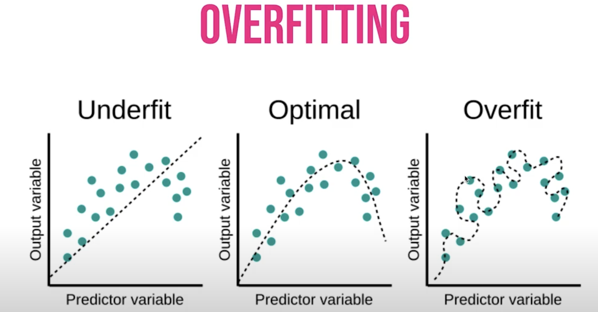
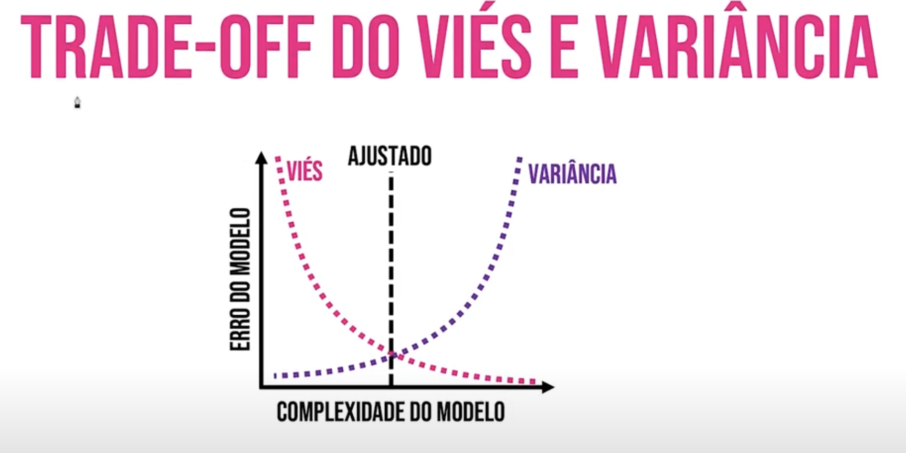

# Decision Tree - Artificial Intelligence Course
3rd lesson of the Artificial Intelligence Crash Course for all 
By Diogo Cortiz (TIDD/PUC-SP) 
[Video at YouTube](https://www.youtube.com/watch?v=ecYpXd4WREk&t=3376s)  

## Theory
Entropy is the measurement of uncentainty:
as bigger the entropy as bigger the mess and uncentainty 
target: reduce entropy 

_Book: The information, Claude Shannon, James Gleick_ 

When we binary values, the maximun entropy is 1.  In multiclasses system, the entropy can be higher. 

### Gain of information

Calculate the feature with better gain of information, for each feature. 
We choose the feature with higher information gain.  
height(son)= n of samples son/n of samples parent  
gain= entropy(parent)-sum heigh (sons)*entropy(sons)  

Information Gain Calculator: https://planetcalc.com/8421/ 

### Recursivity

Overfit: too large tree. 

 

   

### Trade-off of bias and variance

  

  

Variance is how the model adapts to different datasets.  

Overfitting causes high variance because the model behaves well in training and baddly in testing. 

The model fits the data. Many errors = high variable 

## Code
Analysis of a dataset on COVID-19 from the Hospital Israelita Albert Einstein, Brazil. 
About SARS-CoV-2 for almost 6000 patients. 
The dataset was redcucted to learning, removing the less important variables. 

